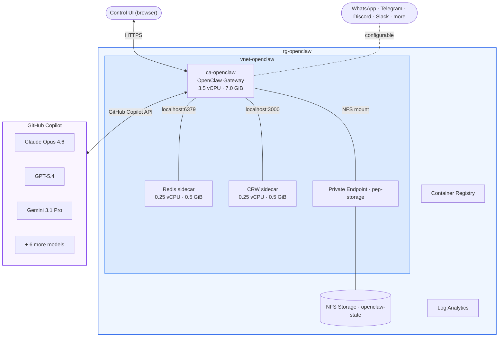
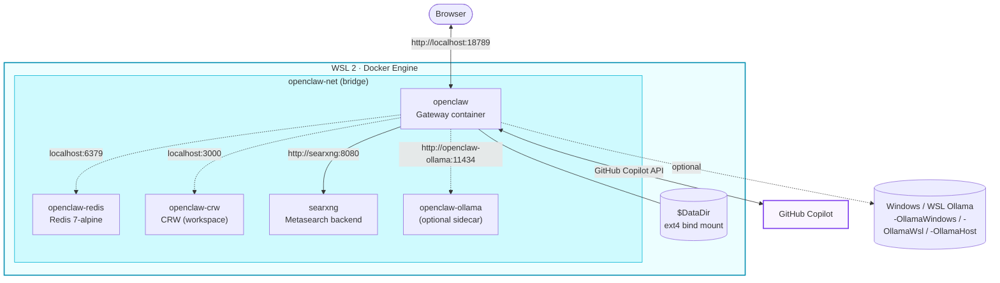

# OpenClaw on Azure Container Apps

<p align="center">
  
</p>

Deploy [OpenClaw](https://github.com/openclaw/openclaw) on Azure Container Apps with GitHub Copilot as the LLM provider.

## What is OpenClaw

[OpenClaw](https://openclaw.ai/) is an open-source, self-hosted personal AI assistant. You run a single Gateway process on your own machine or a server, and it connects your chat apps (WhatsApp, Telegram, Discord, Slack, Signal, iMessage) to AI agents. Built for developers and power users who want a personal assistant they can message from anywhere without giving up control of their data.

[](https://github.com/openclaw/openclaw) · [Docs](https://docs.openclaw.ai/) · [Source](https://github.com/openclaw/openclaw) · [DeepWiki](https://deepwiki.com/openclaw/openclaw)

## What this repo does

This repo provides four ways to run OpenClaw:

1. **Azure Container Apps (ACA)** — Bicep templates and PowerShell scripts that deploy to Azure with managed HTTPS, NFS storage, and consumption-based pricing. The container image builds remotely in Azure Container Registry, so no Docker Desktop is needed.
2. **Azure Kubernetes Service (AKS)** — PowerShell scripts that provision an AKS cluster, reuse the ACA ACR + NFS share, and deploy OpenClaw (with optional **Ollama as a separate pod**) behind a `LoadBalancer` Service. See [`ACA2AKSMigration.md`](./ACA2AKSMigration.md) for a full walkthrough of migrating an existing ACA instance to AKS.
3. **WSL Docker (local)** — PowerShell scripts that build and run OpenClaw as Docker containers inside WSL 2 on your Windows machine. No Azure subscription required. See [`ACA2WSLMigration.md`](./ACA2WSLMigration.md) for migrating an existing ACA instance to WSL.
4. **GitHub Actions (serverless)** — a scheduled workflow that runs OpenClaw's cron jobs on a free Ubuntu runner every 15 minutes instead of a 24/7 Gateway. State persists via the Actions cache; zero infrastructure cost. See [`WSL2GHAMigration.md`](./WSL2GHAMigration.md) for migrating a WSL instance to GitHub Actions.

The ACA, AKS, and WSL options support GitHub Copilot as the LLM provider (device-flow OAuth, no API keys) and offer source-build and npm-install variants (controlled by the `-Npm` switch). The GitHub Actions runtime uses the npm install and carries Copilot auth over in its seed/cache.

## Prerequisites

### Azure Container Apps deployment

- Azure CLI 2.80+ (`az version`)
- An active Azure subscription (`az account show`)
- Git

### Azure Kubernetes Service deployment

- Everything from the ACA prerequisites (the AKS deploy reuses the ACA ACR + NFS storage)
- `kubectl` — install with `az aks install-cli`
- ACA Bicep deployment already applied (the AKS script discovers ACR and storage from its outputs)

### WSL Docker deployment (local)

- Windows 10/11 with [WSL 2](https://learn.microsoft.com/windows/wsl/install)
- Docker Engine running inside WSL (Docker Desktop with WSL 2 backend, or native Docker CE in a WSL distro)
- Git
- PowerShell 5.1+ (ships with Windows)

### GitHub Actions runtime (serverless)

- A **private** GitHub repository (the seed archive and Actions cache can contain credentials)
- [GitHub CLI](https://cli.github.com/) installed and authenticated (`gh auth login`)
- `tar` on PATH (ships with Windows 10/11)
- No Azure subscription, Docker, or always-on machine required

Verify resource providers are registered:

```powershell
az provider show --namespace Microsoft.App --query "registrationState" -o tsv
az provider show --namespace Microsoft.ContainerRegistry --query "registrationState" -o tsv
az provider show --namespace Microsoft.Storage --query "registrationState" -o tsv
az provider show --namespace Microsoft.OperationalInsights --query "registrationState" -o tsv
az provider show --namespace Microsoft.ManagedIdentity --query "registrationState" -o tsv
```

If any show `NotRegistered`: `az provider register --namespace <name>`.

## Deploy (Azure Container Apps)

```powershell
# 1. Clone this repo
git clone https://github.com/spiroskon/openclaw-azure-containerapps.git
cd openclaw-azure-containerapps

# 2. Deploy infrastructure (~5 min)
az group create --name rg-openclaw --location swedencentral
az deployment group create --resource-group rg-openclaw `
  --template-file bicep/main.bicep --parameters bicep/main.bicepparam

# 3. Build and configure OpenClaw (~10 min)
.\deploy-openclaw-ACA.ps1                   # source-build variant
# .\deploy-openclaw-ACA.ps1 -Npm            # npm variant

# 4. Authenticate GitHub Copilot (interactive, ~2 min)
az containerapp exec --name ca-openclaw --resource-group rg-openclaw
#   node openclaw.mjs models auth login-github-copilot   # (source variant)
#   openclaw models auth login-github-copilot            # (npm variant)
#   Follow the device flow in your browser, then type: exit
```

### ACA update

```powershell
.\update-openclaw-ACA.ps1                   # rebuild + roll source variant
.\update-openclaw-ACA.ps1 -Npm              # npm variant
.\update-openclaw-ACA.ps1 -Tag v2026.3.2    # pin to a tag
```

The update script preserves the existing gateway token, env vars, NFS mount, and probes by reading them from the running app before patching.

Open the Control UI URL printed by the script. Send a test message.

### Verify

```powershell
az containerapp show --name ca-openclaw --resource-group rg-openclaw `
  --query "{fqdn:properties.configuration.ingress.fqdn,revision:properties.latestRevisionName}" -o table

az containerapp logs show --name ca-openclaw --resource-group rg-openclaw --tail 20 --type console
```

You should see a valid FQDN, an active revision, and gateway startup logs without crash loops.

---

## Deploy (Azure Kubernetes Service)

Provision AKS and deploy OpenClaw (optionally with **Ollama as a separate pod**) in the same namespace. Reuses the ACR and NFS Azure Files share from the ACA Bicep deployment — you can run this alongside or after the ACA deployment, or use [`ACA2AKSMigration.md`](./ACA2AKSMigration.md) to migrate an existing ACA instance.

```powershell
# 1. Ensure ACA infrastructure exists (provides ACR + NFS storage for AKS to reuse)
az deployment group create --resource-group rg-openclaw `
  --template-file bicep/main.bicep --parameters bicep/main.bicepparam

# 2. Provision AKS and deploy OpenClaw (~15 min)
.\deploy-openclaw-aks.ps1                                   # source-build variant (OpenClaw only)
# .\deploy-openclaw-aks.ps1 -Npm                            # npm variant
# .\deploy-openclaw-aks.ps1 -Ollama                         # explicitly deploy Ollama pod/service
# .\deploy-openclaw-aks.ps1 -Ollama -OllamaModels "llama3.1:8b,qwen2.5:7b"

# 3. Authenticate GitHub Copilot
kubectl -n openclaw exec -it deploy/openclaw -c openclaw -- bash
#   node openclaw.mjs models auth login-github-copilot      # (source variant)
#   openclaw models auth login-github-copilot               # (npm variant)
```

The script prints the external `LoadBalancer` IP plus a Control UI URL with the embedded token. Ollama is now opt-in on AKS and is deployed only when `-Ollama` is provided.

### AKS update

```powershell
.\update-openclaw-aks.ps1                                   # rebuild image, rollout openclaw
.\update-openclaw-aks.ps1 -Npm                              # npm variant
.\update-openclaw-aks.ps1 -Tag v2026.3.2                    # pin source build to a tag
.\update-openclaw-aks.ps1 -OllamaImage ollama/ollama:0.4.0  # bump Ollama pod too
```

The update pins the rolled-out Deployment to the freshly built image **digest** (not the `:latest` tag) so every rollout is deterministic, and sweeps old `base-*` tags in ACR down to `-KeepBaseImages` (default 3).

### AKS useful commands

```powershell
kubectl -n openclaw get pods -o wide
kubectl -n openclaw logs -f deploy/openclaw -c openclaw
kubectl -n openclaw exec deploy/ollama -- ollama list
kubectl -n openclaw get svc openclaw            # external IP
```

---

## Deploy (WSL Docker — local)

Run OpenClaw locally as Docker containers inside WSL 2. No Azure subscription needed.

```powershell
# 1. Clone this repo
git clone https://github.com/spiroskon/openclaw-azure-containerapps.git
cd openclaw-azure-containerapps

# 2. Deploy (source-build variant, ~10 min first time)
.\deploy-openclaw-wsl.ps1

# Or use the npm-install variant
.\deploy-openclaw-wsl.ps1 -Npm
```

Open the Control UI URL printed by the script. Authenticate GitHub Copilot:

```powershell
wsl docker exec -it openclaw bash
#   node openclaw.mjs models auth login-github-copilot
#   Follow the device flow in your browser, then type: exit
```

### WSL deploy options

```powershell
# Source build (default)
.\deploy-openclaw-wsl.ps1

# NPM variant
.\deploy-openclaw-wsl.ps1 -Npm

# Pin to a specific version
.\deploy-openclaw-wsl.ps1 -Tag v2026.3.2

# With Groq API key for cloud inference
.\deploy-openclaw-wsl.ps1 -GroqApiKey sk-...

# With external Ollama for local models
.\deploy-openclaw-wsl.ps1 -OllamaHost http://host.docker.internal:11434

# Custom port and data directory
.\deploy-openclaw-wsl.ps1 -GatewayPort 9000 -DataDir D:\openclaw-data
```

### WSL Ollama options

By default, the WSL deploy script does **not** include an Ollama sidecar — it deploys OpenClaw + Redis only. Use `-Ollama` to add the sidecar, or point at an existing instance with `-OllamaWindows` (Ollama on the Windows host), `-OllamaWsl` (Ollama in WSL), or `-OllamaHost <url>` (any URL). Only one Ollama mode may be used at a time.

The script does **not** auto-install or auto-start native Ollama. Native Ollama is used only when you explicitly pass `-OllamaWindows`, `-OllamaWsl`, or `-OllamaHost`.

```powershell
# Default: OpenClaw + Redis + SearXNG (no Ollama)
.\deploy-openclaw-wsl.ps1

# Add Ollama sidecar + pull 3 default models
.\deploy-openclaw-wsl.ps1 -Ollama

# Ollama sidecar with a specific model instead of the default set
.\deploy-openclaw-wsl.ps1 -Ollama -OllamaModel llama3.1:8b

# Use Ollama running natively on the Windows host (auto-detects host IP)
.\deploy-openclaw-wsl.ps1 -OllamaWindows

# Use Ollama running natively in WSL (auto-detects IP)
.\deploy-openclaw-wsl.ps1 -OllamaWsl

# Use an external Ollama instance at an explicit URL (no sidecar added)
.\deploy-openclaw-wsl.ps1 -OllamaHost http://host.docker.internal:11434

# Expose the gateway on the LAN (0.0.0.0) instead of loopback-only
.\deploy-openclaw-wsl.ps1 -LanAccess
```

> **Note:** For `-OllamaWindows` (and any host-bound instance), Ollama must listen on `0.0.0.0` and be started manually — set `OLLAMA_HOST=0.0.0.0` in the Ollama environment so it accepts connections from the WSL/Docker bridge network. Use `start-ollama-qwen.ps1` to automate this startup and model pull across all 5 deployment environments.

#### Using a local Ollama instance (no sidecar)

If Ollama is already running on your Windows PC, use `-OllamaHost` to point OpenClaw at it instead of spinning up a sidecar container:

```powershell
.\deploy-openclaw-wsl.ps1 -OllamaHost http://host.docker.internal:11434
```

`host.docker.internal` is a special hostname that Docker containers use to reach services on the Windows host. Ollama listens on port `11434` by default.

> **Note:** If Ollama is bound only to `127.0.0.1`, Docker containers cannot reach it ("Connection refused" error). The script automatically kills any existing Ollama process and restarts it with `OLLAMA_HOST=0.0.0.0:11434` to accept Docker bridge network connections. If auto-start fails, manually run in WSL: `OLLAMA_HOST=0.0.0.0:11434 ollama serve`

When using `-OllamaHost`, the script skips the Ollama sidecar container and model pulling entirely — you manage models on the external instance yourself. For external Ollama startup automation, use `start-ollama-qwen.ps1` (WSL 2), `start-ollama-windows.ps1` (native Windows), `start-ollama-aca.ps1` (Azure Container Apps), `start-ollama-aks.ps1` (Kubernetes), or `start-ollama-gha.ps1` (GitHub Actions).

**Ollama management commands** (when sidecar is running):

```powershell
wsl docker exec openclaw-ollama ollama list             # list models
wsl docker exec openclaw-ollama ollama pull <model>     # pull a model
wsl docker exec -it openclaw-ollama ollama run <model>  # interactive chat
wsl docker logs -f openclaw-ollama                      # Ollama logs
```

Model data persists in the `ollama-data` Docker volume across restarts and updates.

### Accessing OpenClaw (WSL)

Once deployed, OpenClaw is accessible from your Windows browser at:

| Endpoint | URL |
|----------|-----|
| Gateway | `http://localhost:18789` |
| Control UI | `http://localhost:18789/#token=<your-gateway-token>` |

The gateway token is printed in a yellow box at the end of the deploy script output. If you lost it, retrieve it from the running container:

```powershell
wsl docker exec openclaw printenv OPENCLAW_GATEWAY_TOKEN
```

**GitHub Copilot auth** (one-time manual step):

```powershell
wsl docker exec -it openclaw bash
# inside the container:
node openclaw.mjs models auth login-github-copilot   # source variant
# openclaw models auth login-github-copilot           # npm variant
# Follow the device flow in your browser, then type: exit
```

### WSL update

```powershell
# Update to latest (rebuilds image, preserves config and gateway token)
.\update-openclaw-wsl.ps1

# Update npm variant
.\update-openclaw-wsl.ps1 -Npm

# Pin to a specific tag
.\update-openclaw-wsl.ps1 -Tag v2026.3.2

# Keep/start the Ollama sidecar during update
.\update-openclaw-wsl.ps1 -Ollama

# Just restart without rebuilding
.\update-openclaw-wsl.ps1 -PullOnly
```

By default, the WSL update script now leaves Ollama disabled unless you pass `-Ollama` or choose one of the host-based Ollama modes.

### WSL useful commands

```powershell
wsl docker logs -f openclaw           # stream logs
wsl docker exec -it openclaw bash      # shell into container
wsl docker compose -f docker-compose-wsl.yaml down    # stop
wsl docker compose -f docker-compose-wsl.yaml restart  # restart
```

### Configure the local data mount path (WSL)

`docker-compose-wsl.yaml` supports a per-machine data path via `OPENCLAW_DATA_DIR`:

```yaml
- ${OPENCLAW_DATA_DIR:-${HOME}/.openclaw-data}:/home/node/.openclaw
```

Set it before running Compose so each machine can choose its own location:

```bash
# Example: default Linux-side path in your WSL home
export OPENCLAW_DATA_DIR="$HOME/.openclaw-data"
mkdir -p "$OPENCLAW_DATA_DIR"
wsl docker compose -f docker-compose-wsl.yaml up -d

# Example: custom Linux-side path
export OPENCLAW_DATA_DIR="/home/$USER/data/openclaw"
mkdir -p "$OPENCLAW_DATA_DIR"
wsl docker compose -f docker-compose-wsl.yaml up -d
```

Use a Linux-side WSL path (ext4). Avoid `/mnt/c/...` for this mount, because Windows DrvFS permissions can appear as `0777` in containers and trigger OpenClaw security checks.

### Working with Books (book-to-skill)

Copy PDF or EPUB files into the OpenClaw container's books directory so the `book-to-skill` feature can process them into learning materials and skills.

#### For WSL Docker deployments

Use `wsl docker cp` to copy files from your Windows machine into the running container:

```powershell
# Copy a single EPUB file
wsl docker cp "C:\Users\YourUsername\Downloads\BookTitle.epub" "openclaw:/home/node/.openclaw/book-to-skill/books/"

# Copy a PDF file
wsl docker cp "C:\Users\YourUsername\Downloads\BookTitle.pdf" "openclaw:/home/node/.openclaw/book-to-skill/books/"

# Example: "Trading Price Action Trends" EPUB (full path, handle spaces with quotes)
wsl docker cp "C:\Users\serdsem\Downloads\Trading Price Action Trends Technical Analysis of Price Charts Bar by Bar for the Serious Trader by Al Brooks.epub" "openclaw:/home/node/.openclaw/book-to-skill/books/"

# Create the books directory first if it doesn't exist
wsl docker exec openclaw mkdir -p /home/node/.openclaw/book-to-skill/books
```

After copying, the file will be available for the book-to-skill pipeline to process. Inside the container, book files are stored at `/home/node/.openclaw/book-to-skill/books/` and persist across container restarts.

#### For Azure Container Apps / AKS deployments

Mount books via the NFS share before deployment, or use `az containerapp exec` / `kubectl cp`:

```powershell
# AKS: copy directly into the pod
kubectl cp "C:\Users\YourUsername\Downloads\BookTitle.epub" \
  openclaw/openclaw:/home/node/.openclaw/book-to-skill/books/ \
  -c openclaw
```

---

## Run (GitHub Actions — serverless)

Run OpenClaw's cron jobs on a free Ubuntu runner every 15 minutes instead of keeping a Gateway up 24/7. Each tick restores `~/.openclaw` from the Actions cache, fires due cron jobs, saves the state back, and shuts down — typically in 2-3 minutes. See [`WSL2GHAMigration.md`](./WSL2GHAMigration.md) for migrating an existing WSL instance.

> Use a **private** repository — the seed archive and Actions cache can contain credentials and session data.

```powershell
# 1. From your repo, configure secrets, build a seed, push it, and trigger the first run
.\deploy-openclaw-gha.ps1 -GenerateGatewayToken -GroqApiKey gsk_... `
    -TelegramBotToken 123456:ABC-DEF -TelegramChatId 2093604311 -PushSeed -Trigger

# 2. Or, if you prefer to do the git/trigger steps yourself:
.\deploy-openclaw-gha.ps1 -GenerateGatewayToken -GroqApiKey gsk_...
git add .github/workflows/openclaw-runtime.yml .github/scripts/run-openclaw-cron.sh `
    deploy-openclaw-gha.ps1 update-openclaw-gha.ps1 gha-helpers.ps1
git add -f seed/openclaw-seed.tar.gz          # private repo only
git commit -m "Add OpenClaw GitHub Actions runtime"
git push origin HEAD
gh workflow run "OpenClaw Runtime"
gh run watch

# 3. Later, to refresh state / rotate secrets / toggle sidecars and re-run
.\update-openclaw-gha.ps1 -GroqApiKey gsk_newkey      # rebuilds seed + triggers a run
```

| Aspect | Detail |
|---|---|
| Schedule | `*/15 * * * *` (best-effort; GitHub may delay under load) + manual `workflow_dispatch` |
| State | `~/.openclaw` via `actions/cache` (rolling key), seeded once from `seed/openclaw-seed.tar.gz` |
| Sidecars | Redis (`redis:7-alpine`) + SearXNG (`searxng/searxng:latest`) + CRW (`ghcr.io/us/crw:latest`) on the runner, same as WSL — toggle with `OPENCLAW_ENABLE_REDIS` / `OPENCLAW_ENABLE_SEARXNG` variables |
| Models | Cloud only (no Ollama/GPU) — give each cron job cloud `fallbacks` |
| Notifications | Optional workflow-level Telegram step (`TELEGRAM_BOT_TOKEN` / `TELEGRAM_CHAT_ID` secrets) |
| Drive mode | `OPENCLAW_GHA_DRIVE` variable: `manual` (default, explicit `cron run --due`) or `scheduler` |

**Repository secrets** (all optional — set only what your jobs use): `GROQ_API_KEY`, `OPENCLAW_GATEWAY_TOKEN`, `TELEGRAM_BOT_TOKEN`, `TELEGRAM_CHAT_ID`.

```powershell
# Useful commands
gh run list --workflow "OpenClaw Runtime"     # recent ticks
gh run view --log                              # logs of the latest run
gh cache list                                  # inspect saved state caches
```

---

## Architecture

### Azure Container Apps



### WSL Docker (local)



The WSL stack always includes OpenClaw, Redis, SearXNG, and CRW. Ollama is opt-in: pass `-Ollama` to add a sidecar container, or `-OllamaWindows` / `-OllamaWsl` / `-OllamaHost <url>` to reuse an existing Ollama instance.

**Python ML Stack:** The Docker image includes PyTorch (CPU), scipy, statsmodels, huggingface_hub, langgraph, langchain, and 20+ scientific packages. Installation order is carefully sequenced to prevent numpy version conflicts: scipy/statsmodels install first (strict numpy requirements), then PyTorch last (adapts to the existing numpy environment). This prevents `numpy.testing` broken and torch library import failures.

This deployment uses `github-copilot/claude-opus-4.6` (the `default` model). GitHub Copilot provides access to models from Anthropic, OpenAI, and Google through a single subscription. Switch models after deployment with `node openclaw.mjs models set <model>`.

<details>
<summary>GitHub Copilot models (from <code>openclaw models list</code>)</summary>

| Model | Provider |
|-------|----------|
| `github-copilot/claude-opus-4.6` | Anthropic (default) |
| `github-copilot/claude-opus-4.7` | Anthropic |
| `github-copilot/claude-sonnet-4.6` | Anthropic |
| `github-copilot/gpt-5.4` | OpenAI |
| `github-copilot/gpt-5.4-mini` | OpenAI |
| `github-copilot/gpt-5.3-codex` | OpenAI |
| `github-copilot/gpt-4o` | OpenAI |
| `github-copilot/gemini-3.1-pro-preview` | Google |
| `github-copilot/gemini-3-flash-preview` | Google |

> The exact model catalog evolves with your GitHub Copilot subscription — run `openclaw models list` for the current set. Additional providers (Ollama, OpenRouter, Groq, xAI) appear here only if you configure them.

</details>

### Resources created by Bicep

| Resource | Type |
|----------|------|
| VNet + 2 subnets | `Microsoft.Network/virtualNetworks` |
| Premium FileStorage + NFS share | `Microsoft.Storage/storageAccounts` |
| Private endpoint + DNS zone | `Microsoft.Network/privateEndpoints` |
| Azure Container Registry | `Microsoft.ContainerRegistry/registries` |
| Log Analytics workspace | `Microsoft.OperationalInsights/workspaces` |
| Container Apps Environment + NFS storage | `Microsoft.App/managedEnvironments` |
| Container App (placeholder) | `Microsoft.App/containerApps` |

`bicep/ollama.bicep` is a separate template that deploys a standalone Ollama Container App into the same environment — used by `deploy-ollama.ps1`. Globally unique names (ACR, storage) are auto-generated using `uniqueString()`.

### Deploy script variants

Six deploy scripts are provided — two per target (ACA, AKS, WSL). Source-build is the default; pass `-Npm` for the npm variant on every script.

| | `deploy-openclaw-ACA.ps1` | `deploy-openclaw-aks.ps1` | `deploy-openclaw-wsl.ps1` |
|---|---|---|---|
| **Target** | Azure Container Apps | Azure Kubernetes Service | WSL Docker (local) |
| **Variants** | `-Npm` switch | `-Npm` switch | `-Npm` switch |
| **Infra source** | `bicep/main[.npm].bicep` | Reuses ACA ACR + NFS; provisions AKS | — |
| **Build method** | `az acr build` (remote) | `az acr build` (remote) | `docker build` inside WSL |
| **Containers / pods** | OpenClaw (3.5 CPU / 7.0 GiB) + Redis (0.25/0.5) + CRW (0.25/0.5) sidecars | OpenClaw + Redis + CRW sidecar pod; Ollama pod | OpenClaw + Redis + SearXNG + CRW (+ optional Ollama sidecar) |
| **Ollama** | Separate Container App (`deploy-ollama.ps1`) | **Separate pod + `ollama` Service** | Sidecar with `-Ollama`, host instance with `-OllamaWindows`/`-OllamaWsl`, or external `-OllamaHost` |
| **Ingress** | Managed HTTPS FQDN | `LoadBalancer` public IP (or Ingress) | `localhost:18789` (or LAN with `-LanAccess`) |
| **Storage** | NFS via private endpoint | Same NFS share via static `PersistentVolume` | Host bind mount |
| **Update script** | `update-openclaw-ACA.ps1` | `update-openclaw-aks.ps1` | `update-openclaw-wsl.ps1` |

All scripts:

1. Auto-discover resources (ACR, storage) from Bicep outputs — no hardcoded names.
2. Build the image remotely (ACA/AKS) or locally (WSL), never requiring Docker Desktop for cloud paths.
3. Generate a 256-bit gateway token (or preserve the existing one on update).
4. Run non-interactive onboard + `models set github-copilot/claude-opus-4.6`.
5. Print the Control UI URL with the embedded token.

### Migration guides

- [`ACA2AKSMigration.md`](./ACA2AKSMigration.md) — move a running ACA instance (state, skills, memory, sessions, gateway token) to AKS with Ollama as a separate pod.
- [`ACA2WSLMigration.md`](./ACA2WSLMigration.md) — move a running ACA instance to a local WSL Docker deployment.

---

## Security

Run the built-in security audit after deployment:

```powershell
az containerapp exec --name ca-openclaw --resource-group rg-openclaw `
  --command "node openclaw.mjs security audit"
```

| Finding | Severity | Context |
|---------|----------|---------|
| `allowInsecureAuth` enabled | CRITICAL | Required for initial setup. Removable through device pairing (below). |
| State dir world-writable (777) | CRITICAL | NFS mount root defaults to 777. Files inside are owned by `node` with correct permissions. |
| No auth rate limiting | WARN | 256-bit token makes brute force infeasible. |

### Device pairing (optional hardening)

Disabling `allowInsecureAuth` switches the Control UI to cryptographic device pairing and removes the critical audit finding.

```powershell
# Get your gateway token
az containerapp exec --name ca-openclaw --resource-group rg-openclaw `
  --command "printenv OPENCLAW_GATEWAY_TOKEN"

# Disable insecure auth
az containerapp exec --name ca-openclaw --resource-group rg-openclaw `
  --command "node openclaw.mjs config set gateway.controlUi.allowInsecureAuth false"

# Restart the container
$rev = az containerapp show --name ca-openclaw --resource-group rg-openclaw `
  --query "properties.latestRevisionName" -o tsv
az containerapp revision restart --revision $rev --resource-group rg-openclaw

# Open/refresh the Control UI in your browser (creates a pending device request)
# Then approve via loopback inside the container:
az containerapp exec --name ca-openclaw --resource-group rg-openclaw `
  --command "node openclaw.mjs devices approve --latest --url ws://127.0.0.1:18789 --token <TOKEN>"
```

If something breaks, re-enable insecure auth:

```powershell
az containerapp exec --name ca-openclaw --resource-group rg-openclaw `
  --command "node openclaw.mjs config set gateway.controlUi.allowInsecureAuth true"
# Restart the revision as above
```

Clearing browser data or switching browsers requires re-pairing.

---

## Design decisions

**Azure Container Apps over ACI or VMs.** Managed HTTPS ingress, automatic TLS, consumption-based pricing, built-in VNet integration.

**NFS over SMB for persistent storage.** NFS authenticates via network rules through the private endpoint, which avoids the `allowSharedKeyAccess: false` restriction enforced by some Azure tenants. SMB would fail silently in those environments.

**Two-phase deployment.** Bicep deploys infrastructure with a placeholder container (Microsoft's ACA quickstart image) to verify networking, storage, and ingress before the deploy script builds the real image and swaps it in.

**GitHub Copilot as LLM provider.** Device-flow OAuth with your existing GitHub account. OpenClaw has a built-in GitHub Copilot provider, so authentication is a one-time browser flow.

---

<details>
<summary><strong>Step-by-step CLI deployment</strong> (without Bicep or deploy script)</summary>

The same deployment done with individual `az` commands. Useful if you want to see exactly what each resource does, customize specific parts, or debug a failing step.

### Step 1: Resource group

```powershell
az group create --name rg-openclaw --location swedencentral
```

### Step 2: Container registry

```powershell
az acr create --name <your-acr-name> --resource-group rg-openclaw `
  --sku Basic --admin-enabled true --location swedencentral
```

ACR names must be globally unique. Check with `az acr check-name --name <name>`.

### Step 3: Build image from source

```powershell
git clone https://github.com/openclaw/openclaw.git openclaw-repo
az acr build --registry <your-acr-name> --image openclaw:latest `
  --file openclaw-repo/Dockerfile openclaw-repo/
```

### Step 4: Networking + NFS storage

NFS is chosen over SMB because some tenants enforce `allowSharedKeyAccess: false`, which blocks ACA's SMB mount. NFS authenticates via network rules (private endpoint).

```powershell
az network vnet create --resource-group rg-openclaw --name vnet-openclaw `
  --location swedencentral --address-prefix 10.1.0.0/26

az network vnet subnet create --resource-group rg-openclaw --vnet-name vnet-openclaw `
  --name snet-aca --address-prefixes 10.1.0.0/27 `
  --delegations Microsoft.App/environments --service-endpoints Microsoft.Storage

az network vnet subnet create --resource-group rg-openclaw --vnet-name vnet-openclaw `
  --name snet-pe --address-prefixes 10.1.0.32/28

az storage account create --name <your-storage-name> --resource-group rg-openclaw `
  --location swedencentral --sku Premium_LRS --kind FileStorage `
  --enable-large-file-share --https-only false

az storage share-rm create --storage-account <your-storage-name> `
  --resource-group rg-openclaw --name openclaw-state --quota 100 --enabled-protocols NFS

$storageId = (az storage account show --name <your-storage-name> `
  --resource-group rg-openclaw --query "id" -o tsv)

az network private-endpoint create --resource-group rg-openclaw --name pep-storage `
  --vnet-name vnet-openclaw --subnet snet-pe `
  --private-connection-resource-id $storageId --group-id file `
  --connection-name connection-storage --location swedencentral

az network private-dns zone create --resource-group rg-openclaw `
  --name "privatelink.file.core.windows.net"

az network private-dns link vnet create --resource-group rg-openclaw `
  --zone-name "privatelink.file.core.windows.net" --name link-vnet `
  --virtual-network vnet-openclaw --registration-enabled false

az network private-endpoint dns-zone-group create --resource-group rg-openclaw `
  --endpoint-name pep-storage --name dnsgroup-storage `
  --private-dns-zone "privatelink.file.core.windows.net" --zone-name file
```

### Step 5: Log Analytics

```powershell
az monitor log-analytics workspace create --resource-group rg-openclaw `
  --workspace-name law-openclaw --location swedencentral
```

### Step 6: Container Apps Environment + NFS storage

```powershell
$SUBNET_ID = (az network vnet subnet show --resource-group rg-openclaw `
  --vnet-name vnet-openclaw --name snet-aca --query "id" -o tsv)
$LAW_ID = (az monitor log-analytics workspace show --resource-group rg-openclaw `
  --workspace-name law-openclaw --query "customerId" -o tsv)
$LAW_KEY = (az monitor log-analytics workspace get-shared-keys --resource-group rg-openclaw `
  --workspace-name law-openclaw --query "primarySharedKey" -o tsv)

az containerapp env create --name cae-openclaw --resource-group rg-openclaw `
  --location swedencentral --infrastructure-subnet-resource-id $SUBNET_ID `
  --logs-workspace-id $LAW_ID --logs-workspace-key $LAW_KEY

az extension add -n containerapp --upgrade
$STORAGE_KEY = (az storage account keys list --account-name <your-storage-name> `
  --resource-group rg-openclaw --query "[0].value" -o tsv)

az containerapp env storage set --name cae-openclaw --resource-group rg-openclaw `
  --storage-name openclawstorage --storage-type NfsAzureFile `
  --server <your-storage-name>.file.core.windows.net `
  --azure-file-share-name /<your-storage-name>/openclaw-state `
  --azure-file-account-name <your-storage-name> --azure-file-account-key $STORAGE_KEY `
  --access-mode ReadWrite
```

### Step 7: Container App

```powershell
$bytes = New-Object byte[] 32
[System.Security.Cryptography.RandomNumberGenerator]::Fill($bytes)
$GATEWAY_TOKEN = [BitConverter]::ToString($bytes).Replace('-','').ToLower()

$ACR_USERNAME = (az acr credential show --name <your-acr-name> --query "username" -o tsv)
$ACR_PASSWORD = (az acr credential show --name <your-acr-name> --query "passwords[0].value" -o tsv)

az containerapp create --name ca-openclaw --resource-group rg-openclaw `
  --environment cae-openclaw --image <your-acr-name>.azurecr.io/openclaw:latest `
  --registry-server <your-acr-name>.azurecr.io `
  --registry-username $ACR_USERNAME --registry-password $ACR_PASSWORD `
  --target-port 18789 --ingress external --min-replicas 1 --max-replicas 1 `
  --cpu 2.0 --memory 4Gi `
  --env-vars "OPENCLAW_GATEWAY_TOKEN=$GATEWAY_TOKEN" "NODE_ENV=production" "HOME=/home/node" "TERM=xterm-256color"
```

Then add NFS volume mount via YAML update (see deploy script for the exact structure).

### Step 8: Configure OpenClaw

```powershell
az containerapp exec --name ca-openclaw --resource-group rg-openclaw
```

Inside the container:

```sh
node openclaw.mjs onboard --non-interactive --accept-risk --mode local --flow manual \
  --auth-choice skip --gateway-port 18789 --gateway-bind lan --gateway-auth token \
  --gateway-token $OPENCLAW_GATEWAY_TOKEN --skip-channels --skip-skills --skip-daemon --skip-health
node openclaw.mjs models set github-copilot/claude-opus-4.6
node openclaw.mjs config set gateway.controlUi.allowInsecureAuth true
node openclaw.mjs models auth login-github-copilot
exit
```

</details>

---

## Known issues

### "Conversation info (untrusted metadata)" in chat

OpenClaw 2026.2.17+ displays a metadata block in the Control UI for every user message:

```
Conversation info (untrusted metadata):
{"message_id": "...", "sender": "openclaw-control-ui"}
[timestamp] your message
```

This is an upstream UI bug, not a deployment issue. The gateway injects `message_id` metadata for LLM context, and the Control UI renders it verbatim instead of stripping it. "Untrusted" refers to the gateway's internal security model (client-supplied metadata is never trusted).

Tracked in [#13989](https://github.com/openclaw/openclaw/issues/13989) and [#20297](https://github.com/openclaw/openclaw/issues/20297). Fix PRs [#14045](https://github.com/openclaw/openclaw/pull/14045) and [#15998](https://github.com/openclaw/openclaw/pull/15998) are pending merge.

**Workaround:** Pin to `v2026.2.15` when building the image.

---

## Cleanup

```powershell
# ACA deployment
az group delete --name rg-openclaw --yes --no-wait

# AKS deployment (only the cluster — keeps ACR + NFS share in rg-openclaw)
az group delete --name rg-openclaw-aks --yes --no-wait
```

## Repository structure

```
├── bicep/                         # Azure infrastructure templates
│   ├── main.bicep / .bicepparam   # Source-build variant
│   ├── mainnpm.bicep / .bicepparam# NPM variant
│   └── ollama.bicep / .bicepparam # Standalone Ollama Container App
├── images/                        # Extended tool-layer Dockerfiles
│   ├── Dockerfile.tools           # Go, gh, Gemini CLI, GoG CLI, etc.
│   └── Dockerfile.npmtools        # Adds Bun, QMD on top of npm base
├── searxng/                       # SearXNG settings (mounted into the searxng container)
├── deploy-openclaw-ACA.ps1        # Azure Container Apps deploy
├── update-openclaw-ACA.ps1        # Azure Container Apps update
├── deploy-openclaw-aks.ps1        # Azure Kubernetes Service deploy (Ollama as separate pod)
├── update-openclaw-aks.ps1        # Azure Kubernetes Service update
├── deploy-openclaw-wsl.ps1        # WSL Docker deploy (local)
├── update-openclaw-wsl.ps1        # WSL Docker update (local)
├── wsl-helpers.ps1                # Shared WSL helpers (compose YAML, DNS repair, Ollama host resolver)
├── docker-compose-wsl.yaml        # Generated compose file used by the WSL scripts
├── deploy-ollama.ps1              # Azure standalone Ollama Container App deploy
├── update-ollama.ps1              # Azure standalone Ollama Container App update
├── imagedeployautomationscripts.ps1 # ACR Tasks / webhook / scheduled Job CI for the ACA image
├── ACA2AKSMigration.md            # Migration guide: ACA → AKS
├── ACA2WSLMigration.md            # Migration guide: ACA → WSL
└── openclaw-repo/                 # Cloned OpenClaw source (gitignored)
```

---

## Tested with

| Component | Version |
|-----------|---------|
| OpenClaw | Latest from `main` branch (Apr 2026) |
| Azure CLI | 2.80+ |
| Bicep | Built-in with Azure CLI |
| Docker (WSL) | 27.x / Docker Desktop 4.x with WSL 2 backend |
| Region | Sweden Central (Azure) |
| LLM | `github-copilot/claude-opus-4.6` |

## Related

- [OpenClaw Secure Docker Setup](https://github.com/spiroskon/openclaw-secure-docker) for running locally on Windows
- [OpenClaw Docs](https://docs.openclaw.ai/)
- [OpenClaw GitHub](https://github.com/openclaw/openclaw)

## License

MIT
